# ES基础概念以及使用

## 1. 基础概念

### 1.1 核心 “倒排索引”

#### 正向索引

如给下表（tb_goods）中的id创建索引：

|  id  |  title   | price |
| :--: | :------: | :---: |
|  1   | 小米手机 | 3499  |
|  2   | 苹果手机 | 4999  |
|  3   | 华为手机 | 4000  |

如果是根据id查询，那么直接走索引，查询速度非常快。

若条件是title符合`"%手机%"`

1）用户搜索数据，条件是title符合`"%手机%"`

2）逐行获取数据

3）判断数据中的title是否符合用户搜索条件

4）如果符合则放入结果集，不符合则丢弃。回到步骤1

逐行扫描，也就是全表扫描，随着数据量增加，其查询效率也会越来越低。当数据量达到数百万时，就是一场灾难。

#### 倒排索引

倒排索引中有两个非常重要的概念：

- 文档（`Document`）：用来搜索的数据，其中的每一条数据就是一个文档。
- 词条（`Term`）：对文档数据或用户搜索数据，利用某种算法分词，得到的具备含义的词语就是词条。例如：小米手机，就可以分为：小米、手机这样的词条。

**创建倒排索引**是对正向索引的一种特殊处理，流程如下：

- 将每一个文档的数据利用算法分词，得到一个个词条
- 创建表，每行数据包括词条、词条所在文档id、位置等信息
- 因为词条唯一性，可以给词条创建索引，例如hash表结构索引

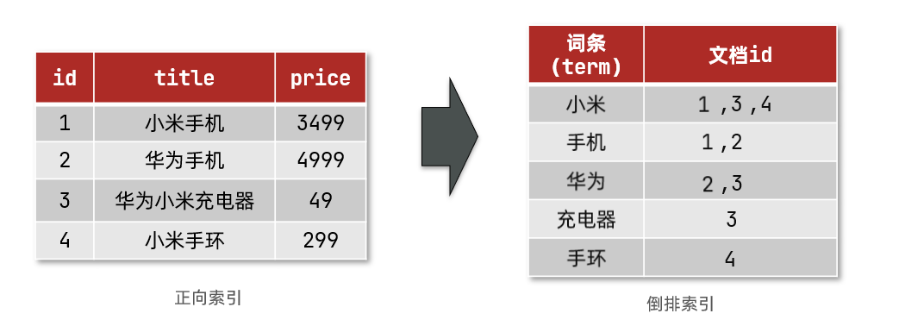

倒排索引的检索流程如下：

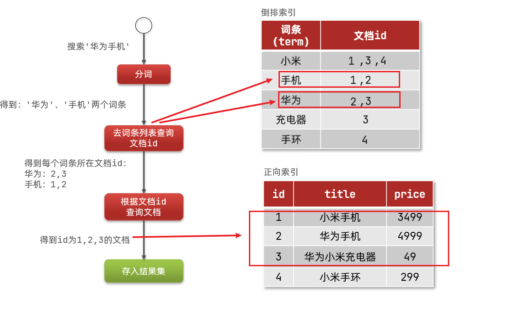

### 1.2 索引和映射

**索引（Index）**，就是相同类型的文档的集合。可以理解为一个**数据库**。

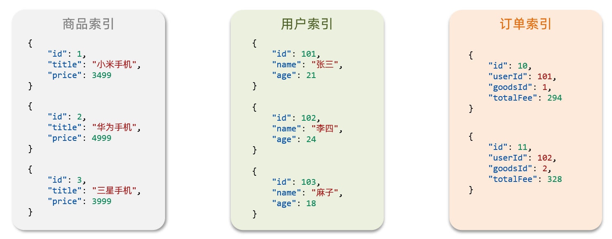

**映射（mapping）**，是索引中文档的字段约束信息，类似表的结构约束。

> 常见的映射属性包括
>
> - type：字段数据类型，常见的简单类型有：
>   - 字符串：text（可分词的文本）、keyword（精确值，例如：品牌、国家、ip地址）
>   - 数值：long、integer、short、byte、double、float、
>   - 布尔：boolean
>   - 日期：date
>   - 对象：object
> - index：是否创建索引，默认为true
> - analyzer：使用哪种分词器
> - properties：该字段的子字段

**示例：**

```json
{
  "mappings": {                     
    "properties": {                 
      "id": {                       // 字段名
        "type": "keyword"					  // 类型为关键字：精确值
      },
      "name": {                     
        "type": "text",             // 类型为文本，可分词
        "analyzer": "ik_max_word",  // 指定分词器
        "copy_to": "all"            // 拷贝到自定义字段 all，与多个字段联合检索
      },
      "address": {
        "type": "keyword",
        "index": false              // index为false表示不参与检索条件，默认为true
      },
      "price": {
        "type": "integer"           // 类型为数值型
      },
      "brand": {
        "type": "keyword",
        "copy_to": "all"            // 拷贝到自定义字段 all，与多个字段联合检索
      },
      "location": {
        "type": "geo_point"         // 类型为地理坐标值,经纬度表示，如"31.249,120.3925"
      },
      "all":{
        "type": "text",
        "analyzer": "ik_max_word"
      }
    }
  }
}
```

**特殊字段说明**

地理坐标：

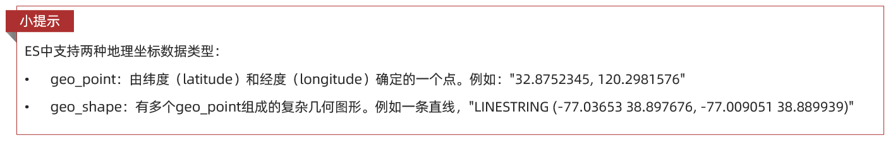

一个组合字段，其目的是将多字段的值 利用copy_to合并，提供给用户搜索：

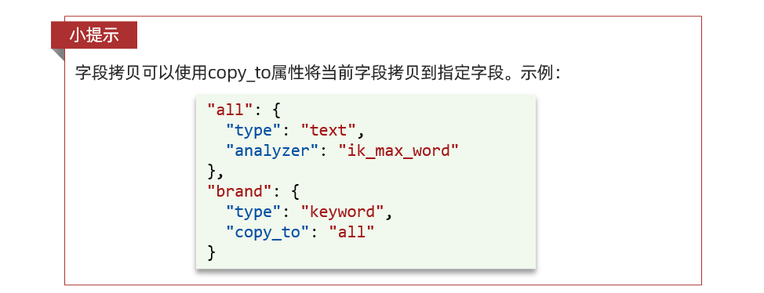

### 1.3 文档和字段

elasticsearch是面向**文档（Document）**存储的。一个文档可以理解为数据库中的一条数据。文档数据会被序列化为json格式后存储在elasticsearch中：

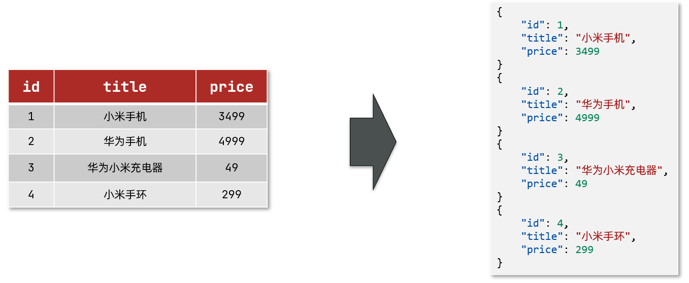

而Json文档中往往包含很多的**字段（Field）**，类似于数据库中的列，在这里表现为`id`、`title`、`price`的值。

**新增的基本操作如下**：

```json
POST /{索引库名}/_doc/1        // /索引库名/_doc/文档id
{
    "name": "Jack",          //  字段：字段值 
    "age": 21                //  字段：字段值
}
```


### 1.4 mysql与elasticsearch

我们统一的把mysql与elasticsearch的概念做一下对比：

| **MySQL** | **Elasticsearch** | **说明**                                                     |
| --------- | ----------------- | ------------------------------------------------------------ |
| Table     | Index             | 索引(index)，就是文档的集合，类似数据库的表(table)           |
| Row       | Document          | 文档（Document），就是一条条的数据，类似数据库中的行（Row），文档都是JSON格式 |
| Column    | Field             | 字段（Field），就是JSON文档中的字段，类似数据库中的列（Column） |
| Schema    | Mapping           | Mapping（映射）是索引中文档的约束，例如字段类型约束。类似数据库的表结构（Schema） |
| SQL       | DSL               | DSL是elasticsearch提供的JSON风格的请求语句，用来操作elasticsearch，实现CRUD |

两者各自有自己的擅长支出：

- Mysql：擅长事务类型操作，可以确保数据的安全和一致性

- Elasticsearch：擅长海量数据的搜索、分析、计算

## 2. RestClient整合Spring使用

### 2.1 环境准备和说明

测试框架及版本：

- elasticsearch 7.12.1
- ik分词器插件 7.12.1
- springboot 2.7.9
- elasticsearch-rest-high-level-client 7.12.1

**1) 覆盖SpringBoot 2.7.9中的es版本配置**

```xml
<properties>
   <!-- 重新指定es的版本，覆盖springboot中的版本 -->
   <elasticsearch.version>7.12.1</elasticsearch.version>
</properties>


<dependencyManagement>
    <dependencies>
        <!-- 重新指定es的版本，覆盖springboot中的版本 -->
        <dependency>
            <groupId>org.elasticsearch.client</groupId>
            <artifactId>elasticsearch-rest-high-level-client</artifactId>
            <version>${elasticsearch.version}</version>
        </dependency>
    </dependencies>
</dependencyManagement>


<!-- elasticsearch -->
<dependency>
    <groupId>org.elasticsearch.client</groupId>
    <artifactId>elasticsearch-rest-high-level-client</artifactId>
</dependency>
```

**2) 配置es的连接客户端**

```java
@Configuration
public class ElasticSearchConfig {
    @Bean
    public RestHighLevelClient restHighLevelClient(){
        return new RestHighLevelClient(RestClient.builder(HttpHost.create("http://192.168.6.94:9200")));
    }
}
```

### 2.2 索引库操作

#### 1）创建索引库

```java
    /**
     * 创建索引库和映射
     */
    @Test
    void createIndexDemo() throws IOException {
        // 创建索引库创建请求
        CreateIndexRequest request = new CreateIndexRequest("shop");
        // 构建mapping映射
        request.source(INDEX_JSON, XContentType.JSON);
        // 执行
        restHighLevelClient.indices().create(request, RequestOptions.DEFAULT);
    }
```

其中`INDEX_JSON`字段的映射值与`Shop`实体类的关系如下图：

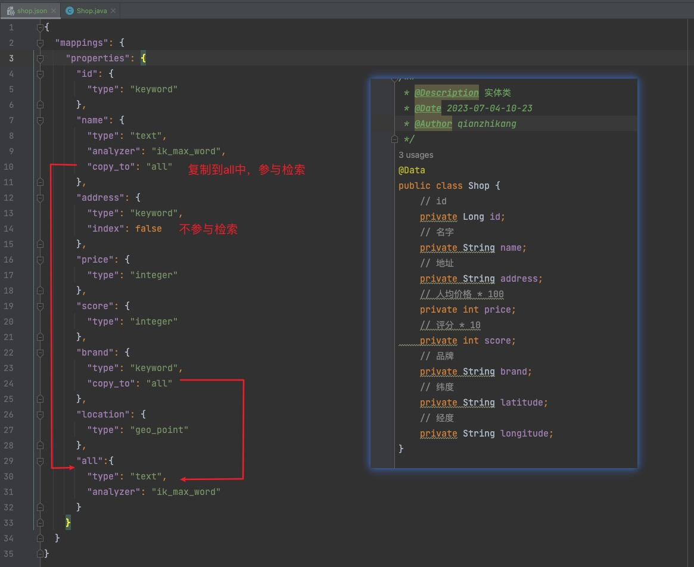

#### 2）删除索引库

```java
    /**
     * 删除索引库
     */
    @Test
    void deleteIndexDemo() throws IOException {
        // 创建索引库删除请求
        DeleteIndexRequest request = new DeleteIndexRequest("shop");
        // 执行
        restHighLevelClient.indices().delete(request, RequestOptions.DEFAULT);
    }
```

#### 3）判断索引库是否存在

```java
    /**
     * 判断索引库是否存在
     * 本质就是Get查询
     */
    @Test
    void GetIndexDemo() throws IOException {
        // 创建索引库查询请求
        GetIndexRequest request = new GetIndexRequest("shop");
        // 执行，使用exists查询是否存在，返回布尔值
        boolean exists = restHighLevelClient.indices().exists(request, RequestOptions.DEFAULT);
        System.out.println(exists ? "已存在" : "不存在");
    }
```

### 2.3 文档操作

#### 1）新增文档

```java
    // 模拟数据
    ShopDto init() {
        Shop shop = new Shop();
        shop.setId(10100001L);
        shop.setBrand("nobrand");
        shop.setPrice(10000);
        shop.setScore(45);
        shop.setName("noname");
        shop.setAddress("local");
        shop.setLatitude("31.2497");
        shop.setLongitude("120.3925");
        return new ShopDto(shop);
    }

    /**
     * 新增文档
     */
    @Test
    void insertDoc() throws IOException {
        // 初始化 shop
        ShopDto shopDto = init();
        // 转为json
        String json = JSON.toJSONString(shopDto);
        // 创建新增请求对象，指定索引库和文档id
        IndexRequest request = new IndexRequest("shop").id(shopDto.getId().toString());
        // 配置json文档
        request.source(json, XContentType.JSON);
        // 执行新增
        restHighLevelClient.index(request, RequestOptions.DEFAULT);
    }
```

#### 2）批量新增

```java
/**
 * 批量新增
 */
@Test
void bulkDocs() throws IOException {
    // 初始化一个shop的list集合, 具体方法略..
    List<ShopDto> shopDtos = initList();
    // 创建批量请求
    BulkRequest request = new BulkRequest();
    // 准备参数，添加多个新增的Request
    shopDtos.forEach(item -> request.add(new IndexRequest("shop")
            .id(item.getId().toString()).source(JSON.toJSONString(item), XContentType.JSON)));
    // 执行批量处理
    restHighLevelClient.bulk(request, RequestOptions.DEFAULT);
}
```

#### 3）查询文档（简单查询）

查询的方法，以下示例仅为最简单的id查询方式，复杂查询在[这里](3. DSL查询文档)

```java
    /**
     * 简单查询文档
     */
    @Test
    void getDocsById() throws IOException {
        // 创建查询请求
        GetRequest request = new GetRequest("shop", "10100001");
        // 执行，获取结果
        GetResponse response = restHighLevelClient.get(request, RequestOptions.DEFAULT);
        // 解析结果
        String json = response.getSourceAsString();

        System.out.println(json);
    }
```

#### 4）删除文档

```java
/**
 * 删除文档
 */
@Test
void deleteDoc() throws IOException {
    // 准备Request,参数为索引库名和删除的id值
    DeleteRequest request = new DeleteRequest("shop", "10100001");
    // 执行
    restHighLevelClient.delete(request, RequestOptions.DEFAULT);
}
```

#### 5）修改文档

- 全量修改：本质是先根据id删除，再新增
- 增量修改：修改文档中的指定字段值

**在RestClient的API中，全量修改与新增的API完全一致，判断依据是ID。**

增量修改：

```java
    /**
     * 修改文档
     */
    @Test
    void UpdateDoc() throws IOException {
        // 构建增量修改的请求
        UpdateRequest request = new UpdateRequest("shop", "10100001");
        // 需要修改的k-v对
        request.doc("name","newname","price",50000);
        // 执行更新
        restHighLevelClient.update(request,RequestOptions.DEFAULT);
    }
```


## 3. DSL查询文档

Elasticsearch提供了基于JSON的DSL（[Domain Specific Language](https://www.elastic.co/guide/en/elasticsearch/reference/current/query-dsl.html)）来定义查询。

### 3.1 全文检索

全文检索查询的基本流程如下：

- 对用户搜索的内容做分词，得到词条
- 根据词条去倒排索引库中匹配，得到文档id
- 根据文档id找到文档，返回给用户

比较常用的场景包括：

- 商城的输入框搜索
- 百度输入框搜索

**基础语法**

```json
GET /indexName/_search
{
  "query": {
    "match": {             // 单字段匹配
      "FIELD": "TEXT"
    }
  }
}


GET /indexName/_search
{
  "query": {
    "multi_match": {         // 多字段匹配
      "query": "TEXT",
      "fields": ["FIELD1", " FIELD12"]
    }
  }
}
--------------------示例---------------------
GET /shop/_search
{
  "query": {
    "match": {
      "all": "苏州中心超市"
    }
  }
}
```

**查询结果解析**

```json
{
   "took":3, 									// 查询所花费的时间，以毫秒为单位
   "timed_out":false,					// 指示查询是否超时，如果为false，则表示查询未超时。
   "_shards":{								// 			包含关于查询分片的信息的对象。
      "total":1,							// 			总共涉及的分片数。
      "successful":1,					// 			成功执行查询的分片数。
      "skipped":0,						// 			跳过的分片数。
      "failed":0              // 			执行查询失败的分片数。
   },
   "hits":{                   // 包含与查询匹配的文档的信息。
      "total":{								// 符合查询条件的文档总数。
         "value":2,						// 文档总数。
         "relation":"eq"      // 关系，表示value值的含义，"eq"表示确切匹配。
      },
      "max_score":0.6951314,  // 匹配文档中的最高分数。
      "hits":[                // 实际匹配的文档列表。
         {
            "_index":"shop",  // 文档所属的索引。
            "_type":"_doc",   // 文档类型。
            "_id":"10100001", // 文档的唯一标识符。
            "_score":0.6951314,  // 文档的匹配分数。
            "_source":{          // 文档的实际内容。
               "address":"local",
               "brand":"苹果",
               "id":10100001,
               "location":"31.2497,120.3925",
               "name":"苹果",
               "price":10000,
               "score":45
            }
         },
         {
            "_index":"shop",
            "_type":"_doc",
            "_id":"10100003",
            "_score":0.5665797,
            "_source":{
               "address":"local",
               "brand":"苹果",
               "id":10100003,
               "location":"31.2497,120.3925",
               "name":"苹果2店",
               "price":30000,
               "score":65
            }
         }
      ]
   }
}
```


**RestClient使用**

```java
@Test
void fullQuery() throws IOException {
    // 1.准备Request
    SearchRequest request = new SearchRequest("shop");
    // 2.准备DSL
    request.source()
            .query(QueryBuilders.matchQuery("all", "苹果"));
    // 3.发送请求
    SearchResponse response = restHighLevelClient.search(request, RequestOptions.DEFAULT);
  	// 4.解析结果
    SearchHit[] hits = response.getHits().getHits();
    for (SearchHit hit : hits) {
        System.out.println(hit.getSourceAsString());
    }
}
```

**结果解析**

```java
    private void handleResponse(SearchResponse response) {
        // 4.解析响应
        SearchHits searchHits = response.getHits();
        // 4.1.获取总条数
        long total = searchHits.getTotalHits().value;
        System.out.println("共搜索到" + total + "条数据");
        // 4.2.文档数组
        SearchHit[] hits = searchHits.getHits();
        // 4.3.遍历
        for (SearchHit hit : hits) {
            // 获取文档source
            String json = hit.getSourceAsString();
            System.out.println(json);
        }
    }
```


### 3.2 精准查询

#### 1) term查询

因为精确查询的字段搜是不分词的字段，因此查询的条件也必须是**不分词**的词条。查询时，输入的内容跟自动值完全匹配时才认为符合条件。

**基础语法**

```json
// term查询
GET /indexName/_search
{
  "query": {
    "term": {
      "FIELD": {
        "value": "VALUE"
      }
    }
  }
}
---------------示例---------------------
// term查询
GET /shop/_search
{
  "query": {
    "term": {
      "FIELD": {
        "score": "45"
      }
    }
  }
}

```


**RestClient使用**

```java
/**
 * 精确查询：词条查询
 * @throws IOException
 */
@Test
void termQuery() throws IOException {
    // 1.准备Request
    SearchRequest request = new SearchRequest("shop");
    // 2.准备DSL
    request.source()
            // term 词条查询，分数为45的
            .query(QueryBuilders.termQuery("score", "45"));
    // 3.发送请求
    SearchResponse response = restHighLevelClient.search(request, RequestOptions.DEFAULT);
    // 解析结果
    handleResponse(response);
}
```


#### 2)  range查询

范围查询，一般应用在对数值类型做范围过滤的时候。


**基础语法**

```json
// range查询
GET /indexName/_search
{
  "query": {
    "range": {
      "FIELD": {
        "gte": 10, // 这里的gte代表大于等于，gt则代表大于
        "lte": 20 // lte代表小于等于，lt则代表小于
      }
    }
  }
}
------------------示例----------------------
// range查询
GET /shop/_search
{
  "query": {
    "range": {
      "price": {
        "gte": 10000, // 这里的gte代表大于等于，gt则代表大于
        "lte": 25000 // lte代表小于等于，lt则代表小于
      }
    }
  }
}
```


**RestClient使用**

```java
/**
 * 范围查询
 */
@Test
void rangQuery() throws IOException {
    // 1.准备Request
    SearchRequest request = new SearchRequest("shop");
    // 2.准备DSL
    request.source()
            // term 词条查询，分数为45的
            .query(QueryBuilders.rangeQuery("price").gte(10000).lte(25000));
    // 3.发送请求
    SearchResponse response = restHighLevelClient.search(request, RequestOptions.DEFAULT);
    // 解析结果
    handleResponse(response);
}
```

### 3.3 聚合查询

**算分函数查询**

一般用于为含有特定字段的文档提升查询打分使用。如需要前置一些广告排名位。

**基础语法说明**

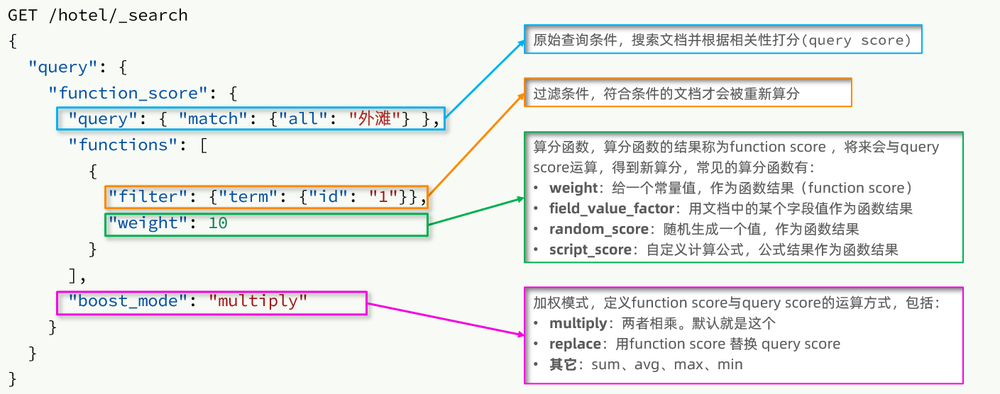


**RestClient使用**

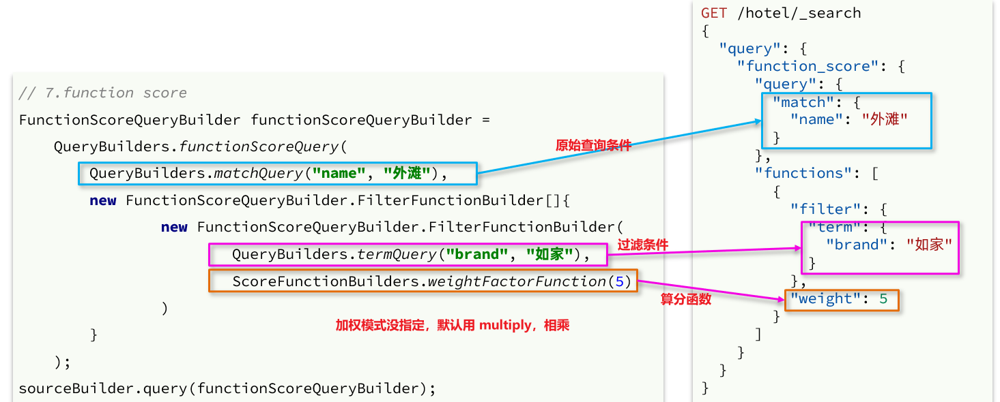

```java
    /**
     * 调整文档算分排名查询
     */
    @Test
    void functionScoreQuery() throws IOException {
        FunctionScoreQueryBuilder functionScoreQuery = QueryBuilders.functionScoreQuery(
                QueryBuilders.matchQuery("brand", "苹果"),      // 原始查询条件
                new FunctionScoreQueryBuilder.FilterFunctionBuilder[]{
                        new FunctionScoreQueryBuilder.FilterFunctionBuilder(
                                QueryBuilders.termQuery("isAd", true),     // 过滤条件
                                ScoreFunctionBuilders.weightFactorFunction(5)           // 算分权重
                        )
                }
        );
        functionScoreQuery.boostMode(CombineFunction.MULTIPLY);         // 加权模式


        // 准备Request
        SearchRequest request = new SearchRequest("shop");
        request.source().query(functionScoreQuery);

        // 查询，处理结果
        SearchResponse res = restHighLevelClient.search(request, RequestOptions.DEFAULT);
        handleResponse(res);
    }
```

### 3.4 布尔查询

布尔查询是一个或多个查询子句的组合，每一个子句就是一个**子查询**。子查询的组合方式有：

- must：必须匹配每个子查询，类似“与”
- should：选择性匹配子查询，类似“或”
- must_not：必须不匹配，**不参与算分**，类似“非”
- filter：必须匹配，**不参与算分**

**基础语法示例**

```json
GET /hotel/_search
{
  "query": {
    "bool": {
      "must": [
        {"term": {"city": "上海" }}
      ],
      "should": [
        {"term": {"brand": "皇冠假日" }},
        {"term": {"brand": "华美达" }}
      ],
      "must_not": [
        { "range": { "price": { "lte": 500 } }}
      ],
      "filter": [
        { "range": {"score": { "gte": 45 } }}
      ]
    }
  }
}
```

**RestClient使用**

```java
/**
     * 布尔查询
     */
    @Test
    void boolQuery() throws IOException {
        BoolQueryBuilder boolQuery = QueryBuilders.boolQuery();
        // 名字必须包含"苹果"
        boolQuery.must(QueryBuilders.termQuery("name", "苹果"));
        // 评分应该大于"65"
        boolQuery.should(QueryBuilders.rangeQuery("score").gte(65));
        // 价格必须大于等于30000
        boolQuery.filter(QueryBuilders.rangeQuery("price")
                .gte(30000));

        // 准备Request
        SearchRequest request = new SearchRequest("shop");
        request.source().query(boolQuery);

        // 查询，处理结果
        SearchResponse res = restHighLevelClient.search(request, RequestOptions.DEFAULT);
        handleResponse(res);
    }
```


### 3.5 地理查询

附近查询，也叫做距离查询（geo_distance）：查询到指定中心点小于某个距离值的所有文档。

换句话来说，在地图上找一个点作为圆心，以指定距离为半径，画一个圆，落在圆内的坐标都算符合条件：


**基础语法**

```json
// geo_distance 查询
GET /indexName/_search
{
  "query": {
    "geo_distance": {
      "distance": "15km", // 半径
      "local": "31.21,121.5" // 圆心
    }
  }
}
```


**地理位置查询**

```java
/**
     * 地理位置查询
     */
    @Test
    void geoQuery() throws IOException {
        // 指定距离查询
        GeoDistanceQueryBuilder location = QueryBuilders
                // 文档中地理位置的字段
                .geoDistanceQuery("location")
                // 指定圆心
                .point(31.2497, 120.3925)
                // 指定距离
                .distance("3km");
        // 准备Request
        SearchRequest request = new SearchRequest("shop");
        request.source().query(location);
        // 查询，处理结果
        SearchResponse res = restHighLevelClient.search(request, RequestOptions.DEFAULT);
        handleResponse(res);
    }
```


**地理位置排序查询**

```java
/**
     * 地理位置排序查询
     */
    @Test
    void geoQuerySort() throws IOException {

        GeoDistanceSortBuilder location = SortBuilders
                // 距离排序，参数为 文档中经纬度字段 和 圆心位置
                .geoDistanceSort("location", new GeoPoint(31.2497, 120.3925))
                // 距离升序
                .order(SortOrder.ASC)
                // 单位km
                .unit(DistanceUnit.KILOMETERS);

        // 准备Request
        SearchRequest request = new SearchRequest("shop");
        request.source().sort(location);
        // 查询，处理结果
        SearchResponse res = restHighLevelClient.search(request, RequestOptions.DEFAULT);
        handleResponse(res);
    }
```


## 4. 查询结果处理

### 4.1 分页&排序

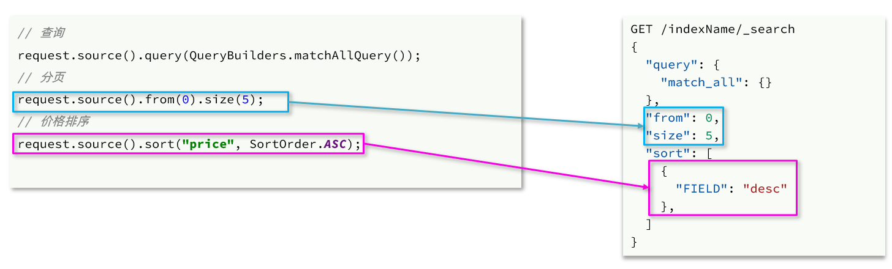

```java
		/**
     * 排序、分页
     */
    @Test
    void pageAndSort() throws IOException {
        // 页码，每页大小
        int page = 1, size = 5;
        // 1.准备Request
        SearchRequest request = new SearchRequest("shop");
        // 2.准备DSL
        // 2.1.query
        request.source().query(QueryBuilders.matchAllQuery());
        // 2.2.排序 sort
        request.source().sort("price", SortOrder.DESC);
        // 2.3.分页 from、size
        request.source().from((page - 1) * size).size(5);
        // 3.发送请求
        SearchResponse response = restHighLevelClient.search(request, RequestOptions.DEFAULT);
        // 4.解析响应
        handleResponse(response);
    }
```


### 4.2 高亮搜索关键字

**高亮查询必须使用全文检索查询，并且要有搜索关键字，才可以对关键字高亮。**

- `field("")`: 这指定应该高亮显示的搜索结果字段。在这个例子中，字段名为"name"。

- `requireFieldMatch(bool)`: 这个设置决定了Elasticsearch是否只高亮显示指定的字段（"name"字段），还是也要高亮显示其他字段中的匹配项。当设置为`false`时，意味着即使搜索查询在其他字段中匹配了词语，高亮显示仍然会应用于"name"字段。（注：在查询字段为复合字段copyto时候，需要设置为false，否则返回highlight结果为空！）


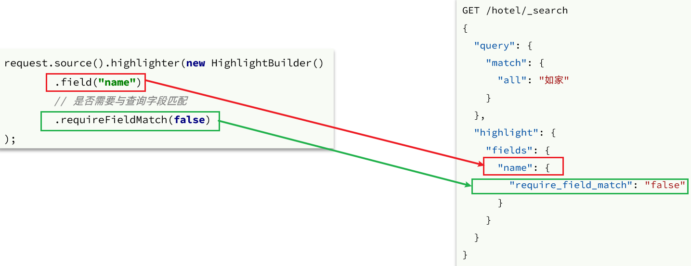

**高亮的结果与查询的文档结果默认是分离的**

查询结果处理

- 从结果中获取source。hit.getSourceAsString()，这部分是非高亮结果，json字符串。还需要反序列为HotelDoc对象
- 获取高亮结果。hit.getHighlightFields()，返回值是一个Map，key是高亮字段名称，值是HighlightField对象，代表高亮值
- 从map中根据高亮字段名称，获取高亮字段值对象HighlightField
- 从HighlightField中获取Fragments，并且转为字符串。这部分就是真正的高亮字符串了
- 用高亮的结果替换HotelDoc中的非高亮结果

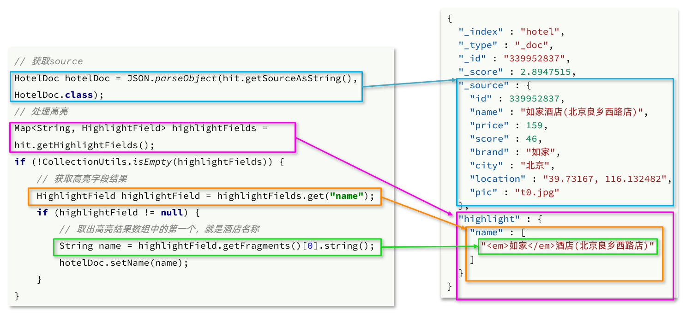

**RestClient中设置查询结果高亮处理**

```java
/**
     * 高亮搜索关键字
     */
    @Test
    void highlightField() throws IOException {
        SearchRequest request = new SearchRequest("shop");
        request.source().query(QueryBuilders.matchQuery("all", "苹果"));
        // 高亮检索配置
        request.source().highlighter(new HighlightBuilder()
                // 那些字段需要匹配高亮
                .field("name").field("brand")
                // 是否只高亮显示指定的字段，由于此例中，查询的是复合字段all，所以只能为false
                .requireFieldMatch(false));
        SearchResponse response = restHighLevelClient.search(request, RequestOptions.DEFAULT);
        // 处理高亮
        handleHighlightResp(response);
    }


    private void handleHighlightResp(SearchResponse response) {
        // 文档数组
        SearchHit[] hits = response.getHits().getHits();
        // 遍历
        for (SearchHit hit : hits) {
            // 获取文档source
            String json = hit.getSourceAsString();
            // 反序列化
            ShopDto shopDto = JSON.parseObject(json, ShopDto.class);

            // 处理高亮关键字
            Map<String, HighlightField> highlightFields = hit.getHighlightFields();
            if (!CollectionUtils.isEmpty(highlightFields)) {
                // 处理name高亮
                HighlightField nameField = highlightFields.get("name");
                if (nameField != null) {
                    // 获取高亮值
                    String name = nameField.getFragments()[0].string();
                    // 覆盖非高亮结果
                    shopDto.setName(name);
                }

                // 处理brand高亮
                HighlightField brandField = highlightFields.get("brand");
                if (brandField != null) {
                    // 获取高亮值
                    String brand = brandField.getFragments()[0].string();
                    // 覆盖非高亮结果
                    shopDto.setBrand(brand);
                }
            }

            System.out.println("shop = " + shopDto);
        }
    }
```

